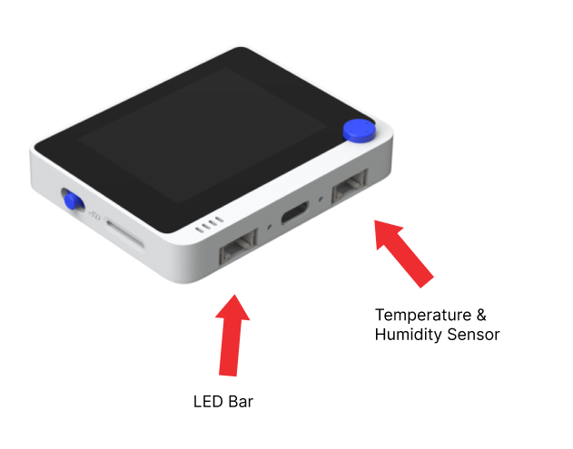
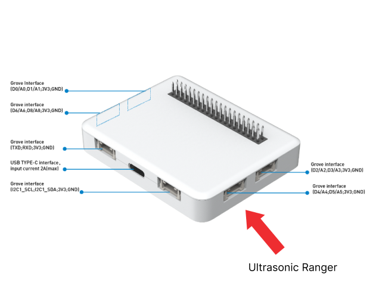
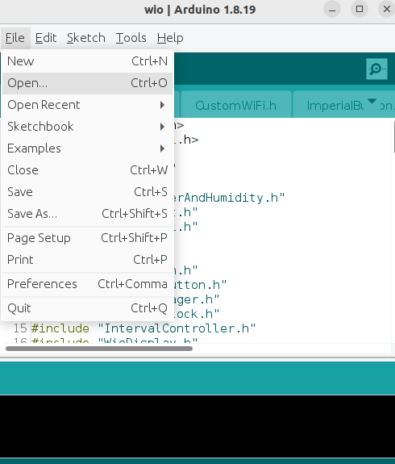
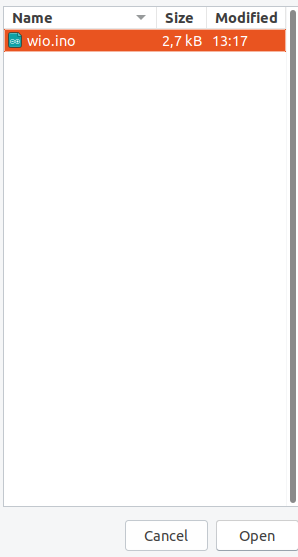
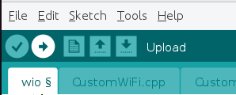

#  Grain Guard

## Description
The developed system is meant to help monitor and manage the conditions and levels of grain inside a silo. Relevant information such as humidity, temperature and grain level will be measured and sent back to the application, where data will be processed, stored and later displayed on the website for easy access. The main goal of the system will be to monitor if the environment inside a silo is suitable for grain and check if the grain level is not above the collection threshold. If any of the conditions are not met, the correct person/people are notified.

## Visuals

## Installation

### Required software
* [Arduino IDE](https://www.arduino.cc/en/software)
* [Java JDK 21](https://www.oracle.com/java/technologies/downloads/#java21)
* [Maven](https://maven.apache.org/install.html)

### Required hardware and sensors
* Microcontroller: [Wio Seeed Terminal](https://wiki.seeedstudio.com/Wio_Terminal_Intro/)
* Battery Chassis: [Wio Terminal Battery Chassis](https://wiki.seeedstudio.com/Wio-Terminal-Battery-Chassis/)
* 3x Cables : [Grove - Cable](https://www.seeedstudio.com/Grove-Universal-4-Pin-20cm-Unbuckled-Cable-5-PCs-Pack-p-749.html)
* [Grove - Ultrasonic Ranger](https://wiki.seeedstudio.com/Grove-Ultrasonic_Ranger/)
* [Grove - LED Bar](https://wiki.seeedstudio.com/Grove-LED_Bar/) 
* [Grove - Temperature&Humidity Sensor (DHT11)](https://wiki.seeedstudio.com/Grove-TemperatureAndHumidity_Sensor/)

### Required Arduino libraries
* [Grove Temperature and Humidity Sensor](https://github.com/Seeed-Studio/Grove_Temperature_And_Humidity_Sensor)
* [Grove LED Bar](https://github.com/Seeed-Studio/Grove_LED_Bar/tree/master)
* [Grove Ultrasonic Ranger](https://github.com/Seeed-Studio/Seeed_Arduino_UltrasonicRanger)
* [ArduinoJson](https://github.com/bblanchttps://www.seeedstudio.com/Grove-Universal-4-Pin-20cm-Unbuckled-Cable-5-PCs-Pack-p-749.htmlhon/ArduinoJson)
* [Seeed Arduino RTC](https://github.com/Seeed-Studio/Seeed_Arduino_RTC/tree/master)
* [Seeed Arduino rpcWiFi](https://github.com/Seeed-Studio/Seeed_Arduino_rpcWiFi)
* [Seeed Arduino rpcUnified](https://github.com/Seeed-Studio/Seeed_Arduino_rpcUnified)
* [Seeed Arduino FS](https://github.com/Seeed-Studio/Seeed_Arduino_FS)
* [Seeed Arduino mbedtls](https://github.com/Seeed-Studio/Seeed_Arduino_mbedtls)
* [PubSubClient](https://github.com/knolleary/pubsubclient/tree/master)
* [NTPClient](https://github.com/arduino-libraries/NTPClient)

To avoid having potential problems with library dependencies, it is advised to install all libraries directly from the GitHub links provided above.

## Usage
* Before downloading the git repository, ensure that all required software and libraries are installed.
* Connect the Battery Chassis with the Wio Terminal by inserting all pins on the battery into the back of the terminal.
* make sure that the battery is charged by trying to turn the terminal on without connecting it with a wire. <br/>
If it is not plug the battery into a computer using the central USB-C port on the battery.
* Connect each sensor to a cable and insert them in the following sockets: 
<div>
    
    
</div>

* Download the GrainGuard repository from GitLab.
* Extract the .zip file to your choice of directory.
* Create a secrets.h file in the /wio folder, according secrets.example.h file, replacing the example text with the correct SSID and password for your wifi network.
* Open the Arduino IDE and open the file called wio.ino, the file is located in .../silo-management-project/wio/wio.ino:
<div>
    
    
</div>

* When you have successfully opened the wio.ino file, ensure that your terminal is connected via the USB-C port to the computer you have arduino IDE open on.
* Now, with the terminal ON, upload the code to your terminal through the Arduino IDE by pressing the arrow button as highlighted below. <br/>
(Note that the following step will not work if the computer is connected to the battery or not at all.)
<div>
    
</div>

* On your computer, open the terminal and change directory so that you end up in .../silo-management-project/silo-webapp/
* run the command: ```mvn clean install```
* If the build fails, you may have multiple versions of java installed. Run the line ```java -version``` if the output version is not JDK 21, you may need to look into changing your path [here.](https://www.java.com/en/download/help/path.html)
* Now, change directory to .../silo-management-project/silo-webapp/src/main/java/group1/silowebbapp/ and run the line: ```javac silowebappapplication.java```
* Lastly, open your webbrowser and enter: http://localhost:8080/


## Contributors:
* Charles Jarju - created a foundation for the Spring Boot Web application by adding appropriate models, controllers, and views that kick-started the development process; added a business logic to the Wio terminal for capturing reading timestamps; created a CI Pipeline for the web application using Maven for the build process (Spring Boot build); created a professionally-looking style for the Wio Terminal display
* Viktor Kolak - created a MQTT logic on the Wio terminal level; added Wi-Fi connectivity to the Wio terminal; Set up a third-party database running PostgreSQL engine; worked on the web application charts; positively contributed to the web application styling; created a wonderful logo for the "company"/website
* Samuel Partain - added business logic for the temperature and humidity sensor; worked on the web application charts; added dynamic updates to the web application charts based on the incoming data 
* Szymon Witt - made signifficant contributions on the refactor front (both on the sensor level as well as on the web application level); worked on the web application styling; added websockets to the web application
* Caroline Grand-Clement - worked on the MQTT client on the web application side; added business logic for Wio terminal buttons; worked on the web application websocket connection; added dynamic pop-ups and banners to the web application; was the strongest PM of the group, coordinating responsibilities, keeping project progress information updated, and keeping team meetings on the highest level  

## Acknowledgements
* Thank you to our TAs Teo Portase and Adrian Hassa.

## License
The project is licensed under the MIT License. Refer to [license](https://git.chalmers.se/courses/dit113/2024/group-1/silo-management-project/-/blob/main/LICENSE?ref_type=heads) for more information.

## Project status
Completed.
